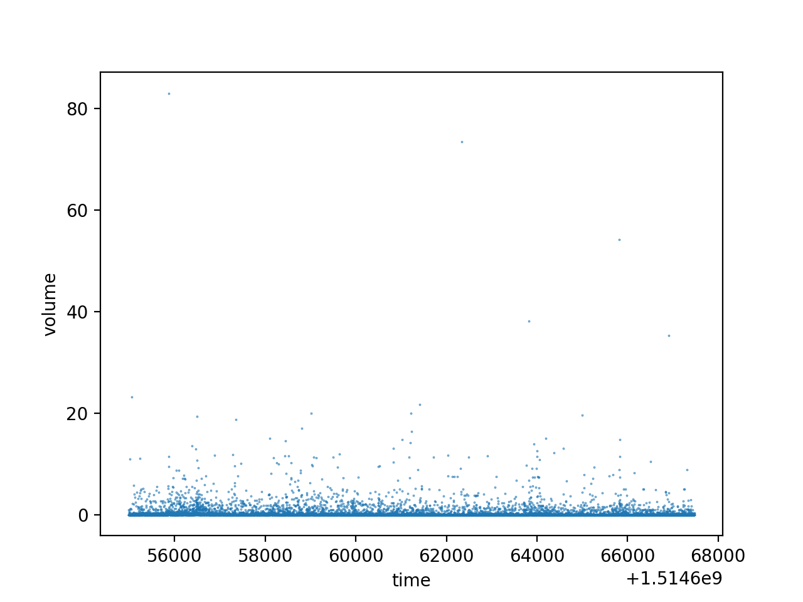

# Stock Price Prediction.

The goal of this project is to predict BTC/USD price using historical trade data,
and to get experience using the `tensorflow.estimator` API.

The raw data has the following features: 

|feature|description|
|-------|-----------|
|size 		| The size of BTC traded  |
|price		| The price in USD per BTC|  
|side		| whether the traded was executed by a buyer or seller |
|time 		| the time at which the trade was executed 

The raw data which is collected from the websocket comes at irregular time
intervals,
and is frequently batched together (so there will be multiple trades with the
same timestamp). In order to resolve this, we resample our data
into one-second intervals, and replace `price` by the average price in that
interval weighted by the size of the trade, and we drop the `side`.  

Next, in order to normalize our inputs, we calculate the feature `change`
from `price`, which is just given by change(t+1) = p(t+1) / p(t).

Our goal is to predict the percent change in price at some `horizon` - 
by default we use a 10 second horizon.  

The inputs to our model are sliding windows of inputs of some fixed length:
the dimension of the features is `batch_size x window_length x m` where `m` is the
number of features. When a file with a length `S` sequence is used for 
evaluation or prediction, the inputs are put into a single tensor of shape 
`1 x S x m` for easy compatibilty between training and evaluation/prediction.

The model architecture uses an LSTM RNN, whose output is fed into a dense layer to
get a prediction. In training, we use rolling windows of size one hundred in order to
increase the number of training samples we have and reduce bias. Our training
loss is mean squared error. 

One hurdle in this model is that mean squared error is not a particurly
informative loss, in the sense that if our goal is to trade according to the
predictions that are agent makes, then it is difficult to interpret the MSE in a
meaningful way. A more instructive metric is what is referred to in finance as
PnL - profit and loss of a trading strategy. The trading strategy we use to
compute this metric is very simple. We have two accounts,  `U` (for USD),  and `B` (for BTC).
At time `t`, we know the current price `p` and make forecast  `f` for the percent change in 
`horizon` seconds. If `f` is positive, we do `U = U - 1` and `B = B + 1/p` (buy
one dollar of BTC). If `f` is negative, we do `U = U + 1`, and `B = B - 1/p`
(sell a dollar of BTC). If `p_final` is the final price, we can then calculate `pnl =
U + p * final` to calculuate our chance in net worth following the betting
strategy, giving us a more intuitive metric of our evaluator.

# Datasets

Use `src.utils.collect` to collect data from GDAX and build your own datasets. A
few datasets are included.

Model is located in `src.models.lstm`, and can be run from command line with
default arguments with `python -m src.models.lstm'.
